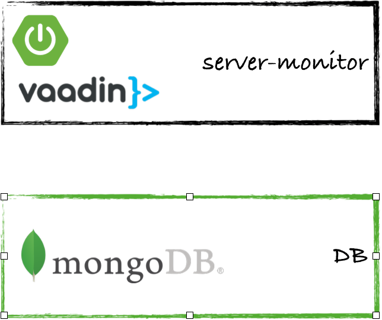

# server-monitor
Extremely simple server monitor. Just to monitor if server is up&running, also maintain historical monitoring data and can add, remove, activate and deactivate servers to monitor.


## Quick start
Instructions to start easily using this project

### Maven
#### Prerrequisites
1. JDK 8 installed
1. Maven installed
1. MongoDB instance available

#### Execution
##### Review configuration
1. Review DB connection properties in applicaton.properties:
    1. **spring.data.mongodb.uri:** maybe you need to use *spring.data.mongodb.host* and *spring.data.mongodb.port* instead
    1. **spring.data.mongodb.database:** if you want to change the database
    1. **server.port:** if you want to change the port that the application is using
1. Review initialization properties in application.properties:
    1. **initialize:** if you need to initialize DB. Please review initialization section in execution parameters.
    1. **reset:** if you need to reset historical table.
1. Compile the application: 

```
mvn clean install
```

1. Go to the target folder
1. Execute the application

```
java -jar server-monitor-0.0.3-SNAPSHOT.jar
```

### Docker
#### Prerrequisites
1. Docker installed in the system. Docker compose should also be available.
1. Ports 27017 and 8080 should be available.

#### Preparation
1. Clone the project into your system
1. Find docker-compose.yml file (it's the only file needed for this option)

#### Execution
1. Open a console and go to the folder containing the docker-compose.yml file
1. Run docker-compose up
1. Now the solution is up&running

## Advanced Options
### Execution parameters

## Application description
### Topology
Application itself it's very simple, just a Spring Boot application using Vaadin and Spring Data to access to a MongoDB database.



Both parts can be executed independient elements, as docker images os as a whole using the provided docker-compose.yml file.

### Elements
Going deeper into the project we can view the elements below:


#### Views
Only one view it's available. It shows four different sections organized in two panels.

##### Left Panel
In this panel you can find the monitored servers and their status.

###### Button panel


###### Monitored Servers grid
A list of the monitored servers, you can see a green tick when the monitorization is active and a grey cross when its inactive.


This grid is used to select the server to be shown in the right panel, it also interacts with the button panel in the top.

###### Current Status grid
#### Right Panel
###### Server Details
###### Historic data

#### Endpoints
Available endpoints are:

##### /monitor
Launchs the process that monitors all the active servers. It returns a JSON with the information of each server and stores this info into the historic table.

##### /historic
Returns the values stored into the historic table.

##### /add
Adds a new server to be monitored to the system.

##### /servers
Returns the list of servers monitored, active and inactive.

##### /activate
Activates one server already added to the system.

##### /deactivate
Deactivates one server already added to the system.

#### Services
#### Scheduled processes
#### Database

## Next Steps
### Improvements
1. Add pagination to tables 

## Software
### IDE
Eclipse
### REST tests
Postman
### Browsers
Safari, Firefox, Chrome and Opera 

## Contact
